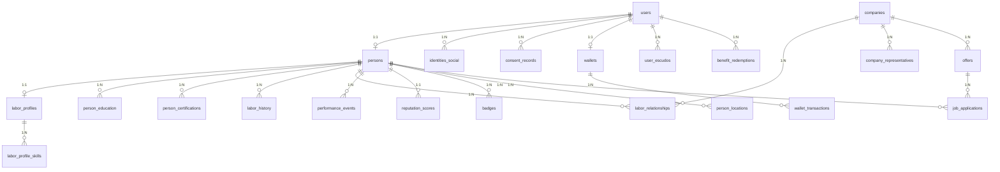
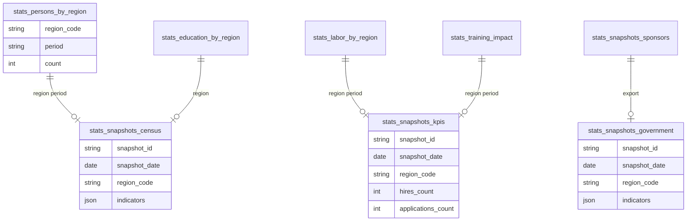
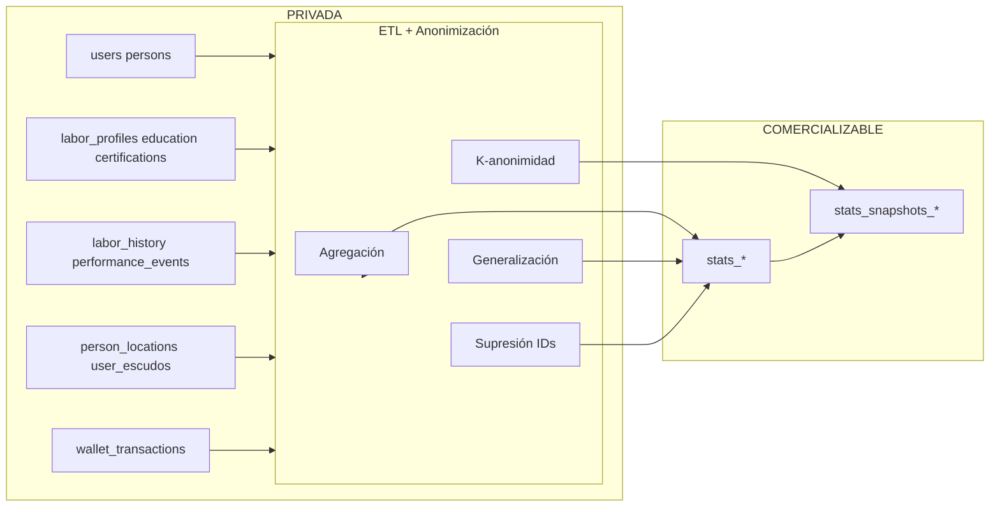

# Modelo de Datos Completo — Censo Digital YAPÓ

**Rol:** Arquitecto senior de datos Big Data, GovTech y plataformas laborales.  
**Objetivo:** Base de datos del Censo Digital con separación estricta de capas, todas las entidades obligatorias, analítica y uso real como censo digital.

---

## 1. Separación estricta de capas

| Capa | Nombre | Contenido | Acceso | Uso |
|------|--------|-----------|--------|-----|
| **PRIVADA** | Datos personales identificables | Cualquier dato que permita identificar a una persona o empresa. | Solo servicios autorizados, auditoría, consentimiento. **No comercializables.** | Operación de la app, cumplimiento contractual, obligaciones legales. |
| **COMERCIALIZABLE** | Datos anonimizados y estadísticos | Agregados, rangos, conteos, snapshots; sin `user_id` ni claves que reidentifiquen. | Dashboards, reportes, gobierno, sponsors, productos de datos. | Censo digital, KPIs laborales, métricas para sponsors, informes para gobierno, impacto de capacitaciones. |

**Reglas obligatorias:**

- Ningún dato de la capa PRIVADA se escribe en la capa COMERCIALIZABLE.
- La capa COMERCIALIZABLE **no contiene** identificadores; solo indicadores y agregados anonimizados.
- Flujo único: PRIVADA → (ETL + anonimización) → COMERCIALIZABLE.

En el resto del documento se usan los nombres de esquema **PERSONAL** (= PRIVADA) y **STATS** (= COMERCIALIZABLE) para alinear con DDL y código existente.

---

## 2. Entidades del modelo

### 2.1 Identidad del usuario (PRIVADA)

| Entidad | Atributos principales | Descripción |
|---------|------------------------|-------------|
| `users` | `id`, `created_at`, `verification_level`, `primary_role`, `registration_layer` | Identidad mínima; sin datos sensibles en esta tabla. |
| `identities_social` | `user_id`, `provider`, `provider_user_id`, `email`, `display_name`, `avatar_url`, `consent_type`, `consent_at` | Login social; solo con consentimiento. |
| `persons` | `id`, `user_id`, `first_name`, `last_name`, `document_type`, `document_number`, `birth_date`, `gender`, `phone`, `email`, `address_region`, `address_city`, `consent_census` | Persona física identificable; vinculada a `users`. |
| `consent_records` | `id`, `user_id`, `consent_type`, `granted`, `timestamp`, `consent_version` | Registro de consentimientos. |
| `verification_events` | `id`, `user_id`, `document_type`, `result`, `biometric_level`, `verified_at` | Resultado verificación (sin documento ni biometría en crudo). |

---

### 2.2 Perfil laboral (PRIVADA)

| Entidad | Atributos principales | Descripción |
|---------|------------------------|-------------|
| `labor_profiles` | `id`, `person_id`, `summary` (texto), `skills` (array o JSON), `preferred_sectors`, `preferred_region`, `availability`, `created_at`, `updated_at` | Perfil laboral: resumen, habilidades, preferencias de sector/región, disponibilidad. |
| `labor_profile_skills` | `labor_profile_id`, `skill_code`, `level` (opcional) | Habilidades etiquetadas por perfil. |

**STATS (COMERCIALIZABLE):** Conteos por `region_code`, `period`, `skill_category`, `sector_preference` (sin person_id).

---

### 2.3 Formación académica (PRIVADA)

| Entidad | Atributos principales | Descripción |
|---------|------------------------|-------------|
| `person_education` | `id`, `person_id`, `institution_name`, `level` (primaria\|secundaria\|terciaria\|curso\|posgrado), `title`, `year_from`, `year_to`, `verified` | Formación por persona. |

**STATS:** `stats_education_by_region` (region_code, period, education_level, count), `stats_education_by_sector`; impacto de capacitaciones (ver § 4).

---

### 2.4 Certificaciones (PRIVADA)

| Entidad | Atributos principales | Descripción |
|---------|------------------------|-------------|
| `person_certifications` | `id`, `person_id`, `name`, `issuer`, `issued_at`, `expires_at`, `verified`, `certification_type` (opcional) | Certificaciones por persona. |

**STATS:** `stats_certifications_by_sector`, `stats_certifications_by_region`, `stats_training_impact` (impacto de capacitaciones: antes/después por región/sector, anonimizado).

---

### 2.5 Historial laboral (PRIVADA)

| Entidad | Atributos principales | Descripción |
|---------|------------------------|-------------|
| `labor_relationships` | `id`, `person_id`, `company_id`, `role`, `start_date`, `end_date`, `status`, `contract_type` | Relación laboral persona–empresa. |
| `labor_history` | `id`, `person_id`, `company_name_anon` (opcional, solo para stats), `role`, `sector`, `start_date`, `end_date`, `reason_end` (opcional) | Historial de empleos (para CV y analítica; en STATS solo agregados). |
| `job_applications` | `id`, `person_id`, `offer_id`, `applied_at`, `status` | Postulaciones. |
| `offers` | `id`, `company_id`, `title`, `sector`, `region_code`, `created_at`, `status`, `filled_at` | Ofertas de trabajo. |

**STATS:** Contrataciones por región/sector/periodo, postulaciones agregadas, tiempo promedio hasta contratación (rangos).

---

### 2.6 Desempeño y reputación (PRIVADA)

| Entidad | Atributos principales | Descripción |
|---------|------------------------|-------------|
| `performance_events` | `id`, `person_id`, `type` (rating\|badge\|review), `score` (1-5 o similar), `from_entity_id` (company o user), `created_at`, `metadata` (JSON sin PII) | Eventos de valoración (rating, badge, revisión). |
| `reputation_scores` | `person_id`, `trust_score` (0-100), `last_calculated_at` | Puntuación de reputación calculada (ej. por rol). |
| `badges` | `id`, `person_id`, `badge_type`, `granted_at`, `granted_by` (opcional, referencia anonimizada en stats) | Insignias o badges del usuario. |

**STATS:** Distribución de puntuaciones por región/sector (rangos), conteo de badges por tipo/región, promedios de desempeño agregados (nunca individuales).

---

### 2.7 Territorio y GPS (PRIVADA → STATS)

| Entidad (PRIVADA) | Atributos principales | Descripción |
|-------------------|------------------------|-------------|
| `person_locations` | `id`, `person_id`, `lat`, `lng`, `accuracy_m`, `captured_at`, `purpose` | Ubicaciones con consentimiento; retención limitada. |
| `territories` | `id`, `name`, `region_code`, `geometry` (o ref) | Territorios definidos. |
| `territory_semaphore_snapshots` | `territory_id`, `state` (green\|yellow\|red), `recorded_at` | Semáforo por territorio. |

**STATS:** Actividad por región, distribución del semáforo por zona, conteos de uso de mapa/ubicación por región (sin IDs).

---

### 2.8 Escudos y beneficios (PRIVADA → STATS)

| Entidad (PRIVADA) | Atributos principales | Descripción |
|-------------------|------------------------|-------------|
| `user_escudos` | `id`, `user_id`, `escudo_id` (fintech\|comunidad\|insurtech\|regalos), `active`, `activated_at`, `region_code` (opcional) | Escudos activados por usuario (alineado a features/escudos). |
| `benefit_redemptions` | `id`, `user_id`, `benefit_type`, `reference`, `redeemed_at` | Canje de beneficios (sin datos externos identificables en STATS). |

**STATS:** Adopción de escudos por región/sector/periodo; beneficios canjeados por tipo/región (conteos); métricas para sponsors (alcance, activaciones por campaña anonimizada).

---

### 2.9 Wallet — sin dinero real (PRIVADA → STATS)

| Entidad (PRIVADA) | Atributos principales | Descripción |
|-------------------|------------------------|-------------|
| `wallets` | `id`, `user_id`, `balance`, `currency`, `status` | Cartera por usuario. |
| `wallet_transactions` | `id`, `wallet_id`, `type`, `amount`, `reference`, `created_at`, `status` | Movimientos. |

**STATS:** Volumen en rangos, conteo de transacciones y carteras activas por región/periodo (sin montos exactos ni IDs).

---

### 2.10 Empresas (PRIVADA → STATS)

| Entidad (PRIVADA) | Atributos principales | Descripción |
|-------------------|------------------------|-------------|
| `companies` | `id`, `ruc`, `legal_name`, `trade_name`, `sector`, `size`, `address_region`, `address_city` | Empresas identificables. |
| `company_representatives` | `company_id`, `user_id`, `role`, `verified_at` | Representantes. |

**STATS:** Conteos por región, sector, tamaño; sin RUC ni nombres en exportaciones.

---

### 2.11 Snapshots estadísticos anonimizados (solo COMERCIALIZABLE)

Snapshots = fotos agregadas en un momento dado para censo e informes.

| Entidad (STATS) | Atributos principales | Descripción |
|-----------------|------------------------|-------------|
| `stats_snapshots_census` | `snapshot_id`, `snapshot_date`, `region_code`, `period`, `persons_count`, `companies_count`, `labor_active_count`, `education_level_breakdown` (JSON), `escudos_active_count` (por tipo) | Snapshot tipo censo por región y fecha. |
| `stats_snapshots_kpis` | `snapshot_id`, `snapshot_date`, `region_code`, `period`, `hires_count`, `applications_count`, `offers_published`, `offers_filled`, `training_completions_count`, `avg_trust_score_bucket` | KPIs laborales por zona y período. |
| `stats_snapshots_sponsors` | `snapshot_id`, `campaign_id_anon` (opcional), `region_code`, `period`, `reach_count`, `activations_count`, `redemptions_count` | Métricas para sponsors (alcance, activaciones, canjes) sin datos personales. |
| `stats_snapshots_government` | `snapshot_id`, `snapshot_date`, `region_code`, `period`, `indicators` (JSON: empleo, formalización, sectores) | Esquema estable para informes gobierno; solo indicadores agregados. |

Todos sin `user_id`, `person_id` ni `company_id`. Particionamiento recomendado por `snapshot_date` y `region_code`.

---

## 3. Diagramas lógicos

### 3.1 Capa PRIVADA (PERSONAL) — entidades completas

### 3.2 Capa COMERCIALIZABLE (STATS) — solo agregados y snapshots

### 3.3 Flujo PRIVADA → Anonimización → COMERCIALIZABLE

---

## 4. Analítica preparada (capa COMERCIALIZABLE)

| Objetivo | Fuente STATS | Descripción |
|----------|--------------|-------------|
| **KPIs laborales** | `stats_labor_by_region`, `stats_snapshots_kpis` | Contrataciones, postulaciones, ofertas publicadas/cubiertas, tiempo hasta contratación (rangos), por región y período. |
| **Reportes por zona** | Todas las tablas `stats_*` y `stats_snapshots_*` filtradas por `region_code` | Totales y tendencias por departamento/distrito; exportación segura por zona. |
| **Impacto de capacitaciones** | `stats_education_by_region`, `stats_certifications_by_sector`, `stats_training_impact` | Personas que completan formación/certificación por región/sector; indicadores antes/después (anonimizados) para medir impacto. |
| **Métricas para sponsors** | `stats_snapshots_sponsors`, adopción escudos/beneficios por región/periodo | Alcance, activaciones, canjes por campaña (sin datos personales); dashboards bajo contrato. |
| **Informes para gobierno** | `stats_snapshots_government`, `stats_snapshots_census` | Indicadores de empleo, formalización, sectores, censo digital por región y período; esquema estable y exportación segura. |

---

## 5. Cumplimiento legal, escalabilidad y uso como censo digital

- **Cumplimiento legal:** Solo datos con consentimiento en capa PRIVADA; separación clara; sin venta de identificables; retención según política (ver `docs/legal`).
- **Escalabilidad nacional:** `region_code` estándar (departamento/distrito) en todas las tablas STATS; particionamiento por `period`/`region`; ETL escalable (batch o streaming).
- **Uso real como censo digital:** Los snapshots y tablas STATS alimentan indicadores de población laboral, empresas, formación, contrataciones y territorio; exportación segura para políticas públicas y convenios gubernamentales.

Documentos relacionados: `REGLAS-ANONIMIZACION.md`, `ESQUEMAS-SQL-NOSQL-Y-EXPORT.md`, `docs/legal/POLITICA-DE-PRIVACIDAD.md`.
