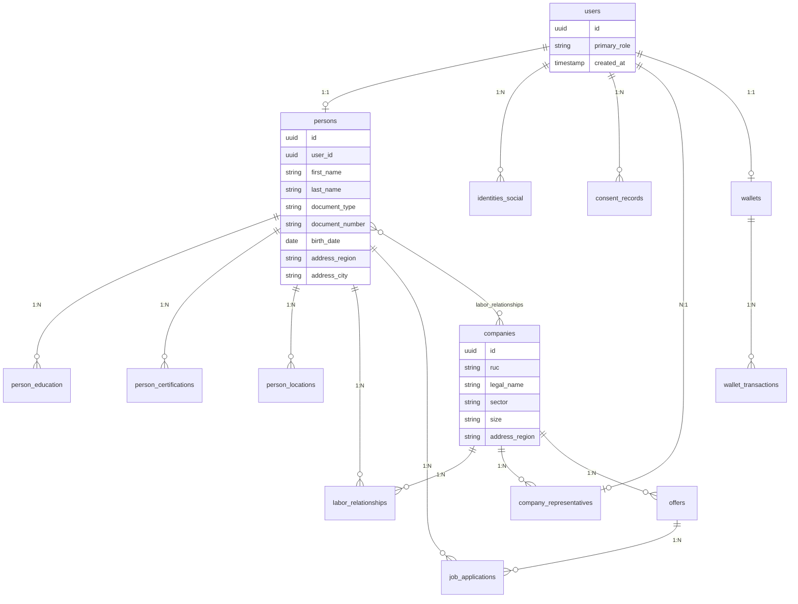
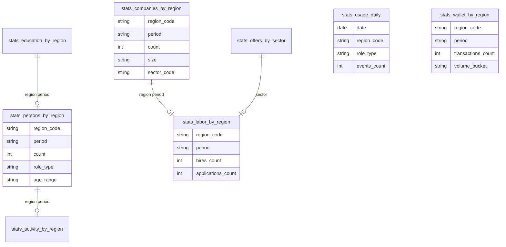
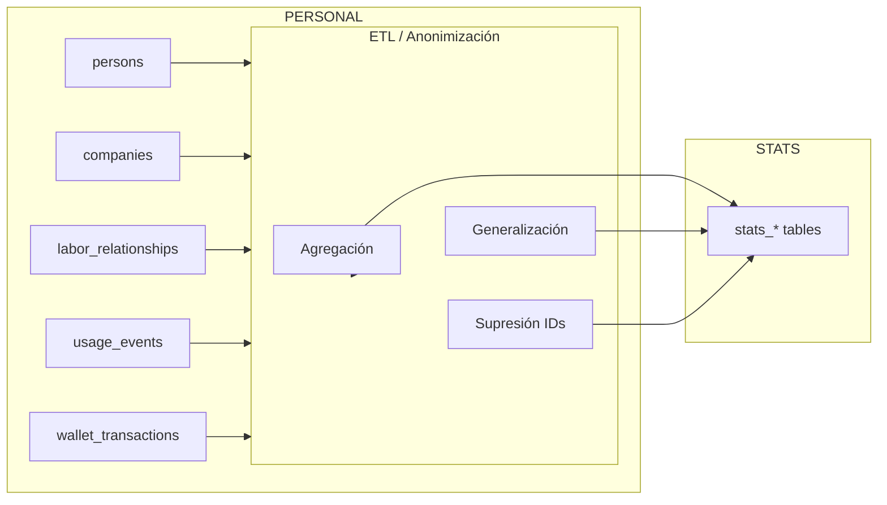

# Modelo de Datos — Censo Digital YAPÓ

**Rol:** Arquitecto de datos senior Big Data / GovTech.  
**Objetivo:** Base de datos del Censo Digital con separación estricta identificables vs anonimizados, cumplimiento legal y escalabilidad nacional.

---

## 1. Principio de separación

Dos capas **física o lógicamente separadas**:

| Capa | Contenido | Acceso | Uso |
|------|-----------|--------|-----|
| **PERSONAL** (identificables) | Datos que permiten identificar a una persona o empresa. | Solo servicios autorizados; auditoría; consentimiento. | Operación de la app, cumplimiento contractual, obligaciones legales. |
| **STATS** (anonimizados/estadísticos) | Agregados, rangos, conteos; sin `user_id` ni claves que reidentifiquen. | Dashboards, reportes, gobierno, sponsors. | Censo digital, KPIs laborales, métricas, políticas públicas. |

**Regla:** Ningún dato identificable se escribe en STATS. El flujo es siempre PERSONAL → (ETL/anonimización) → STATS.

---

## 2. Entidades del modelo

### 2.1 Personas (trabajadores)

Corresponden a usuarios con rol laboral (vale, capeto, kavaju, mbarete) o que ofrecen servicios (cliente, pyme como persona). Se apoyan en `users` e identidad existente.

**PERSONAL (schema `personal` o BD transaccional):**

| Entidad / tabla | Atributos | Descripción |
|-----------------|-----------|-------------|
| `persons` | `id` (PK, FK a users.id o mismo UUID), `user_id`, `first_name`, `last_name`, `document_type`, `document_number`, `birth_date`, `gender` (si consentido), `phone`, `email`, `address_region`, `address_city`, `created_at`, `updated_at`, `consent_census` | Datos identificables del trabajador. Solo con consentimiento. |
| `persons_contact` | `person_id`, `channel` (email\|phone\|whatsapp), `value`, `is_primary`, `consent_at` | Contactos; uno por canal. |

**STATS (schema `stats` / data warehouse):**

| Entidad / vista | Atributos | Descripción |
|-----------------|-----------|-------------|
| `stats_persons_by_region` | `region_code`, `period` (mes/año), `count`, `role_type`, `age_range`, `gender_aggregate` | Conteos por región, período, rol agregado, rango etario, género agregado. Sin IDs. |
| `stats_persons_by_sector` | `sector_code`, `period`, `count`, `activity_type` | Trabajadores por sector/actividad (clasificación anonimizada). |

**Relaciones:** `persons.user_id` → `users.id`; en STATS no hay FK a personas.

---

### 2.2 Empresas (PyME / Enterprise)

**PERSONAL:**

| Entidad | Atributos | Descripción |
|---------|-----------|-------------|
| `companies` | `id` (PK), `ruc`, `legal_name`, `trade_name`, `sector`, `size` (pyme\|enterprise), `address_region`, `address_city`, `contact_email`, `contact_phone`, `created_at`, `updated_at` | Datos identificables de la empresa. |
| `company_representatives` | `company_id`, `user_id`, `role` (representante\|admin), `verified_at` | Vinculación empresa–usuario. |

**STATS:**

| Entidad | Atributos | Descripción |
|---------|-----------|-------------|
| `stats_companies_by_region` | `region_code`, `period`, `count`, `size` (pyme\|enterprise), `sector_code` | Conteos de empresas por zona, tamaño, sector. |
| `stats_companies_by_sector` | `sector_code`, `period`, `count`, `size` | Empresas por sector y tamaño. |

---

### 2.3 Formación y certificaciones

**PERSONAL:**

| Entidad | Atributos | Descripción |
|---------|-----------|-------------|
| `person_education` | `id`, `person_id`, `institution_name` (o código anonimizado si se exporta a stats), `level` (primaria\|secundaria\|terciaria\|curso\|certificación), `title`, `year_from`, `year_to`, `verified` | Formación por persona. |
| `person_certifications` | `id`, `person_id`, `name`, `issuer`, `issued_at`, `expires_at`, `verified` | Certificaciones. |

**STATS:**

| Entidad | Atributos | Descripción |
|---------|-----------|-------------|
| `stats_education_by_region` | `region_code`, `period`, `education_level`, `count` | Personas por nivel de formación y región (anonimizado). |
| `stats_certifications_by_sector` | `sector_code`, `period`, `certification_type`, `count` | Certificaciones agregadas por sector. |

---

### 2.4 Actividad laboral

**PERSONAL:**

| Entidad | Atributos | Descripción |
|---------|-----------|-------------|
| `labor_relationships` | `id`, `person_id`, `company_id`, `role`, `start_date`, `end_date`, `status` (active\|ended), `contract_type` (si aplica) | Relación laboral persona–empresa. |
| `job_applications` | `id`, `person_id`, `offer_id`, `applied_at`, `status` | Postulaciones a ofertas. |
| `offers` | `id`, `company_id`, `title`, `sector`, `region_code`, `created_at`, `status` | Ofertas de trabajo (identificables para operación). |

**STATS:**

| Entidad | Atributos | Descripción |
|---------|-----------|-------------|
| `stats_labor_by_region` | `region_code`, `period`, `hires_count`, `applications_count`, `contract_type_aggregate` | Contrataciones y postulaciones por zona y período. |
| `stats_offers_by_sector` | `sector_code`, `region_code`, `period`, `offers_count`, `filled_count` | Ofertas y cobertura por sector/región. |

---

### 2.5 Territorio y GPS

**PERSONAL:**

| Entidad | Atributos | Descripción |
|---------|-----------|-------------|
| `person_locations` | `id`, `person_id`, `lat`, `lng`, `accuracy_m`, `captured_at`, `purpose` (offer_search\|semaphore\|other) | Ubicaciones con consentimiento; uso limitado y con retención. |
| `territories` | `id`, `name`, `region_code`, `geometry` (o ref a zonas) | Territorios definidos (alineado a lib/territory). |
| `territory_semaphore_snapshots` | `territory_id`, `state` (green\|yellow\|red), `recorded_at` | Estado del semáforo por territorio (sin identificar personas). |

**STATS:**

| Entidad | Atributos | Descripción |
|---------|-----------|-------------|
| `stats_activity_by_region` | `region_code`, `period`, `active_users_count`, `sessions_count`, `location_checks_count` | Actividad agregada por región (sin IDs). |
| `stats_semaphore_by_region` | `region_code`, `period`, `green_pct`, `yellow_pct`, `red_pct`, `territories_count` | Distribución del semáforo por zona. |

---

### 2.6 Uso de plataforma

**PERSONAL (logs/eventos con user_id; retención limitada):**

| Entidad | Atributos | Descripción |
|---------|-----------|-------------|
| `usage_events` | `id`, `user_id`, `event_type`, `screen`, `payload` (json, sin PII), `created_at` | Eventos de uso para análisis operativo; depurar o anonimizar antes de pasar a STATS. |

**STATS (recomendado NoSQL o tabla de agregados):**

| Entidad | Atributos | Descripción |
|---------|-----------|-------------|
| `stats_usage_daily` | `date`, `region_code` (opcional), `role_type`, `events_count`, `unique_sessions_estimate` (k-anón) | Uso diario agregado por tipo de rol y zona. |
| `stats_feature_adoption` | `period`, `feature`, `region_code`, `count` | Adopción de funciones por zona/período. |

---

### 2.7 Wallet (sin dinero real)

**PERSONAL:**

| Entidad | Atributos | Descripción |
|---------|-----------|-------------|
| `wallets` | `id`, `user_id`, `balance` (entero/centavos simulado), `currency`, `status`, `created_at`, `updated_at` | Cartera por usuario. |
| `wallet_transactions` | `id`, `wallet_id`, `type`, `amount`, `counterparty_wallet_id` (opcional), `reference`, `created_at`, `status` | Movimientos; sin datos externos identificables en STATS. |

**STATS:**

| Entidad | Atributos | Descripción |
|---------|-----------|-------------|
| `stats_wallet_by_region` | `region_code`, `period`, `transactions_count`, `total_volume_buckets` (rangos), `active_wallets_count` | Volumen y conteos por región en rangos; sin montos exactos ni IDs. |

---

## 3. Diagramas lógicos

### 3.1 Capa PERSONAL (simplificado)

### 3.2 Capa STATS (solo agregados, sin FKs a personas)

### 3.3 Flujo de datos PERSONAL → STATS

---

## 4. Integración con esquema existente

- **Identidad:** `persons.user_id` referencia a `users.id` del esquema de identidad (`docs/arquitectura/ESQUEMA-BASE-DATOS-IDENTIDAD.md`). Opcionalmente `persons` puede vivir en el mismo esquema que `users` o en uno `personal`.
- **Consentimiento:** Antes de escribir en `persons`, `person_locations`, etc., comprobar consentimiento (censo, datos territoriales, etc.) vía `consent_records` / `hasConsent`.
- **Territorio:** `territories` y semáforo alineados a `lib/territory`; en STATS solo agregados por `region_code` o `territory_id` genérico.

---

## 5. Cumplimiento y escalabilidad

- **Cumplimiento legal:** Solo datos con consentimiento; separación clara identificables vs anonimizados; retención según política; sin venta de identificables (ver `docs/legal/POLITICA-DE-PRIVACIDAD.md`).
- **Escalabilidad nacional:** `region_code` (departamento, distrito o estándar gubernamental) en todas las tablas STATS; particionamiento por `period`/`region` en warehouse.
- **Gobierno:** STATS expone solo agregados; acuerdos pueden definir esquemas de export (por ejemplo por departamento, sector, período) sin exponer PERSONAL.

Documentos relacionados: `REGLAS-ANONIMIZACION.md`, `ESQUEMAS-SQL-NOSQL-Y-EXPORT.md`.
